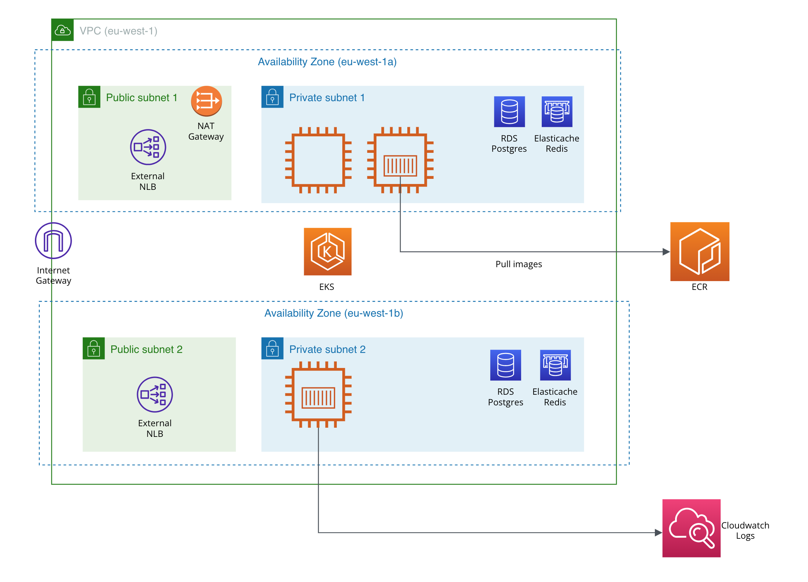

# System diagram of solution deployed to AWS

This Terraform repository provision resources on AWS to support the deployment of [Revolut User Service](https://github.com/awhdesmond/revolut-user-service).

## Reliability Considerations

| Dimension                         | Description                                                                                                                                                           |
| --------------------------------- | --------------------------------------------------------------------------------------------------------------------------------------------------------------------- |
| Scalability (Compute)             | Easy to increase number of nodes in EKS Managed Node Groups, or add more node groups.                                                                                 |
| Scalability (Database)            | Deploy RDS Read Replicas to scale read queries.                                                                                                                       |
| Reliability (HA)                  | Multi-AZ deployment for EKS, RDS, Elasticache to fend against single AZ failures. Pods of User Service API are deployed across AZs using `topologySpreadConstraints`. |
| Reliability (Business Continuity) | RDS automated backups.                                                                                                                                                |
| Performance (latency)             | Leverage on Elasticache to improve latency for read queries, and reduce load on primary RDS instance.                                                                 |
| Observability                     | Structured logging to Cloudwatch logs. Expose Applications metrics in Prometheus format.                                                                              |
| Security (Secrets & Encryption)   | Do not store secrets in repository and leverage on AWS Secrets manager to sync secrets into EKS cluster. Encryption enabled for RDS as we are storing user data.      |
| Security (IAM)                    | Use IRSA and dedicated IAM roles for different cluster workloads. (Principle of least privilege)                                                                      |

## VPC

One VPC is created in `eu-west-1` with 2 public and 2 private subnets.

* VPC primary IPv4 CIDR is `10.0.0.0/16`.
* Each subnet has a `/18` CIDR range.
* Internet Gateway is deployed to provide internet access to the VPC.
* NAT Gateway is deployed in one of the public subnet to provide internet access to private subnets.
* Route tables are configured accordingly for each subnet to route default `0.0.0.0/0` traffic to the correct gateways.

## RDS

A RDS Postgres instance is created within the private subnet.

* Security group only allow traffic at port `5432` from private subnets' CIDR ranges.
* Random password is generated and store in AWS Secret Manager. (This will be used later by pod in EKS)
* Encryption is enabled as we are storing sensitive users' data.
* Multi-AZ is enabled for HA.
* One read replica is created for HA and read performance.

## Elasticache

A Redis Elasticache cluster is created within the private subnet.
* Security group only allow traffic at port `6379` from private subnets' CIDR ranges.
* Random password is generated and store in AWS Secret Manager. (This will be used later by pod in EKS)
* Transit encryption is enabled as we are accessing sensitive users' data.
* Each node group (shard) has 1 write and 1 read replica.
* Elasticache configuration URL will be used by user-service to discover the redis cluster.

## EKS

An EKS Kubernetes cluster is deployed in the VPC to provide container orchestration platform

* EKS addons used: `vpc-cni`, `kube-proxy`, `coredns`.
* Enable `ENABLE_PREFIX_DELEGATION` mode for `vpc-cni`.
* Managed node group will only deploy worker nodes in private subnets.
* IAM OIDC Connect provider is enabled to support IRSA workloads that need to interact with AWS API (e.g `aws-lbc`).

## ECR

An ECR repository is created to store container images for the user service.

## CloudWatch Logs

For logs.

## Revolut Service Account Role

We refactor the logic to create IAM roles for EKS Kubernetes service accounts into a module `eks-sa-role`. This module can be used to grant EKS Kubernetes service accounts permissions
to retrieve secrets from AWS Secret manager.

# EKS Components

## Platform components

Platform components provide foundational cluster-level functionalities and capabilities to support services deployed by product developers.

### AWS-LBC

The AWS Load Balancer controller (`aws-lbc`) provisions AWS Network Load Balancer (NLB) and Application Load Balancer (ALB) resources. The LBC watches for new service or ingress Kubernetes resources and configures AWS resources.

The LBC is supported by AWS. Some clusters may be using the legacy "in-tree" functionality to provision AWS load balancers. The AWS Load Balancer Controller should be installed instead.

### NGINX Ingress

Ingress controller for Kubernetes using NGINX as a reverse proxy and load balancer.

### Secrets Store CSI Provider

Secrets Store CSI Driver for Kubernetes secrets - Integrates secrets stores with Kubernetes via a Container Storage Interface (CSI) volume.

The Secrets Store CSI Driver `secrets-store.csi.k8s.io` allows Kubernetes to mount multiple secrets, keys, and certs stored in enterprise-grade external secrets stores into their pods as a volume. Once the Volume is attached, the data in it is mounted into the container’s file system.

### FluentBit

Send logs from containers to Amazon CloudWatch Logs.

## Applications

### Revolut User Service

Kubernetes `Deployment` of a simple "Hello World" application that manages users' date of birth.

* Spread across AZs using `topologySpreadConstraints`
* Interacts with RDS and Elasticache

## Future Work

1. Leverage on pgpool to load-balance queries between RDS primary and read replicas.
2. Secure User Service API endpoint using authentication mechanism such as JWT and service accounts.
3. Deploy metrics-server and use HPA/KEDA to dynamically autoscale user service deployment based on CPU usage.
4. Create IPv6 EKS clusters to increase pod density per cluster.
5. Restrict EKS API Endpoint to only private endpoint.

